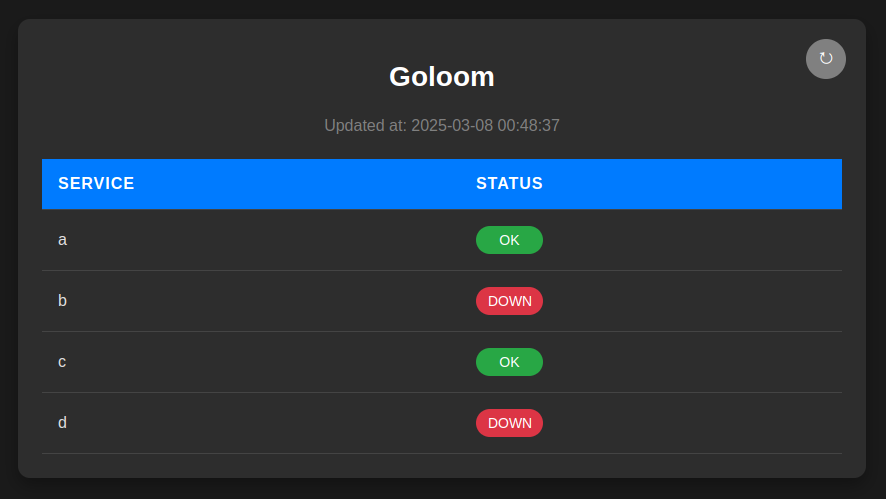
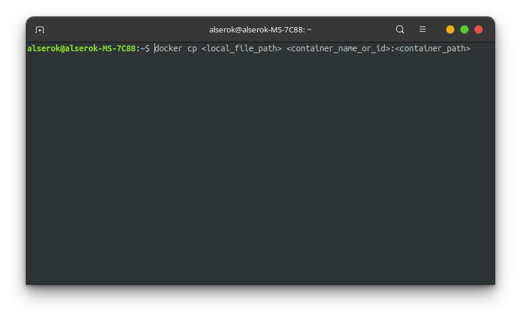

# Goloom 🪼

---

Goloom is useful tool for online configuration your apps and monitoring their states.

### State checker

Monitor your services state using web interface

---

## Simple setup

    

## Configuration

### Via webpage

### Via terminal

