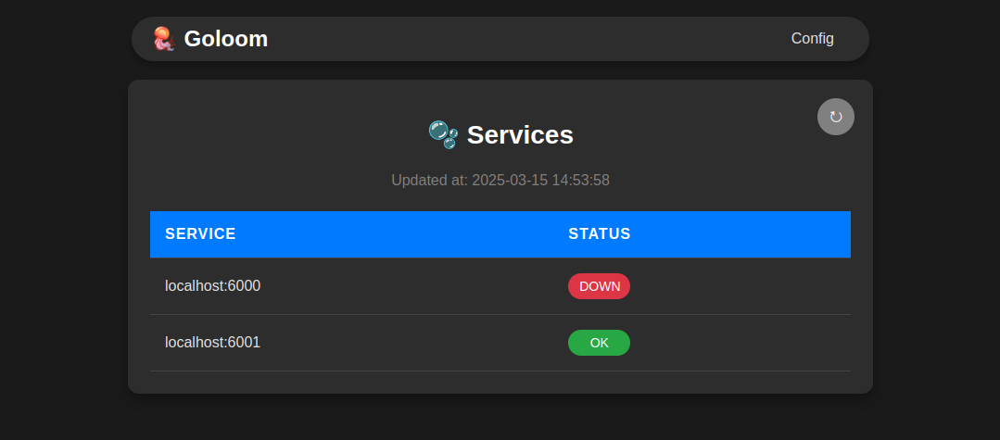
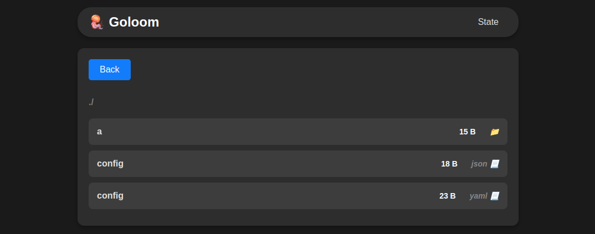
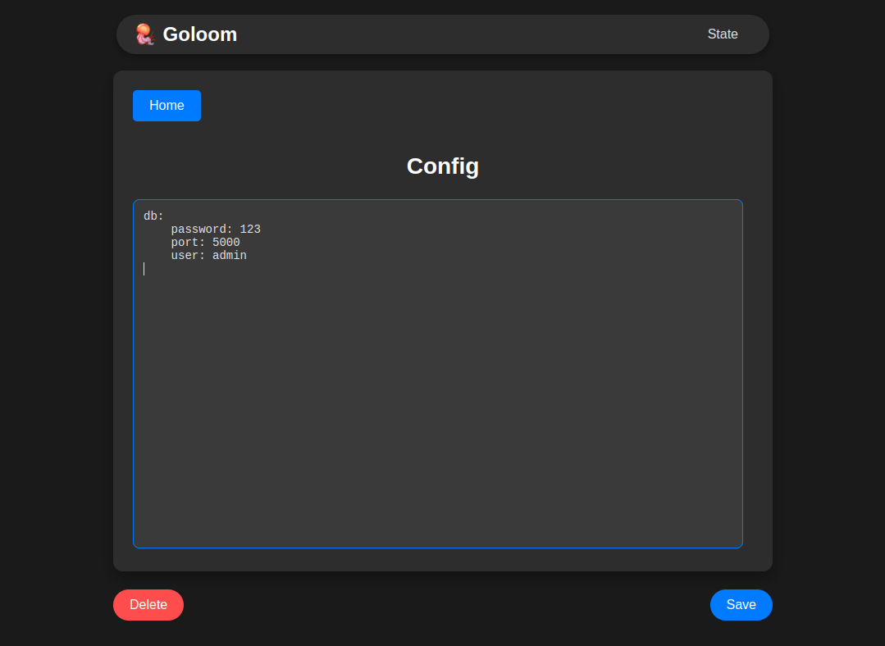

# Goloom 🪼

### Goloom - useful tool for online configuration your apps and monitoring their states.

### Services state

*Monitor services health*


### Folders and files

*Setup your complex folder structures*


### Configurable files

*Change your `json`, `yaml` and `yml` files online and your services will be notified about the changes*




## Simple setup

### If you are not using sdk, your app should provide `GET /health` and `POST /provide` routes. 
1. The first one will let `goloom` know if app is alive and should it be 
provided with file updates or not.
2. The second one will let `goloom` make requests with data updates

Body that you will receive
```json
{
  "contentBytes": "your file bytes",
  "path": "./path_to_your_file.extension"
}
```

### To add and remove your app
    
`Post` request    

    http://${goloom_host}:${goloom_port}/service/add?port={$app_port}

`Delete` request

    http://${goloom_host}:${goloom_port}/service/remove?port={$app_port}

## Examples

### App example

```go
package main

import (
	"encoding/json"
	"fmt"
	"net/http"
	"strconv"

	goloom "github.com/alserok/goloom/pkg/sdk/v1"
)

const (
	port = 5000
)

type Config struct {
	Path         string `json:"path"`
	ContentBytes []byte `json:"contentBytes"`
}

func main() {
	mux := http.NewServeMux()

	goloomClient := goloom.NewClient("http://localhost:6070", strconv.Itoa(port))
	goloomClient.NotifyStart()
	defer goloomClient.NotifyClosure()

	// Goloom checks service state by this route
	mux.HandleFunc("/health", func(writer http.ResponseWriter, request *http.Request) {
		writer.WriteHeader(http.StatusOK)
	})

	// Goloom sends file updates by this route
	mux.HandleFunc("/provide", func(writer http.ResponseWriter, request *http.Request) {
		var cfg Config
		json.NewDecoder(request.Body).Decode(&cfg)

		fmt.Println(cfg)
	})

	http.ListenAndServe(fmt.Sprintf(":%d", port), mux)
}

```

### Compose file example

```yaml
version: '3.8'

services:
  goloom:
    image: goloom
    build:
      context: .
    ports:
      - '6070:6070'
    environment:
      PORT: 6070
      ROOT_DIR: './data'
      # DIRS: "service1/db/mysql;service1/cache;service3"  optional, creates folders
      CHECK_PERIOD: '3s'
      ENV: 'DEV'
```

## Import files

### Via terminal

To import your config files via terminal you may use

    docker cp config.yaml goloom:/goloom/${ROOT_DIR}

